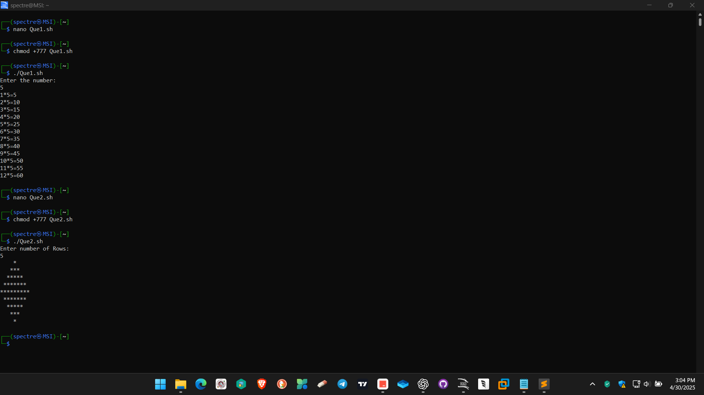
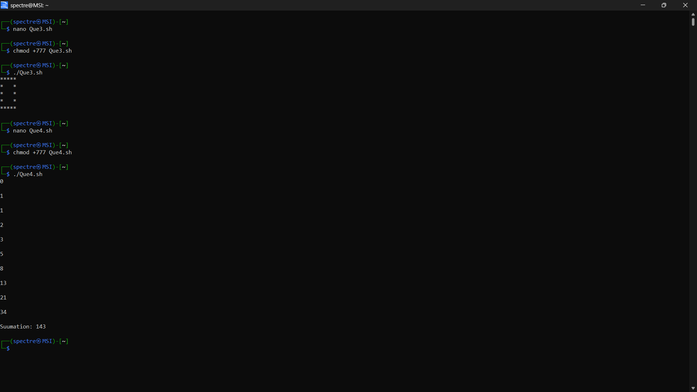
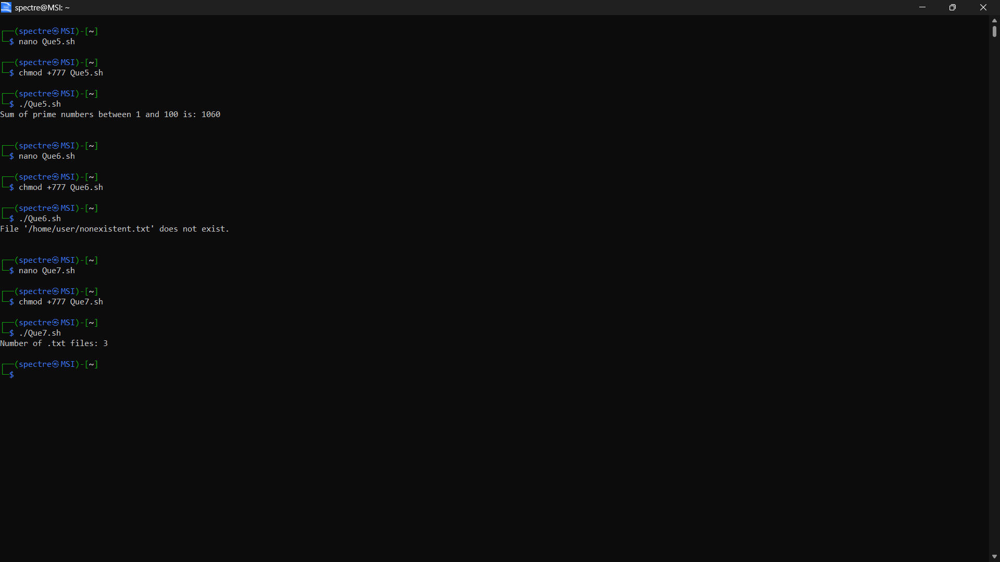

# Operating System Course - Day 06

[](https://learn.microsoft.com/en-us/windows-server/administration/windows-commands/windows-commands)
[](https://www.microsoft.com/windows)
[]()
[]()

> 📚 A comprehensive collection of daily practical lessons for Operating System course focusing on shell scripting.

## 📋 Course Overview

This repository contains practical exercises and implementations for the Operating System course. Each lesson focuses on shell scripting with practical examples and their outputs.

## 🗓️ Day 06 Content

### 🎯 Exercise 1: Multiplication Table

**Description**: Print multiplication table using for loop

**Code Explanation**:
```bash
echo "Enter the number: "
read num
for((i=1;i<=12;i++))
do
mul=$(($i*$num))
echo "$i*$num=$mul"
done
```

**Output**:


### 🎯 Exercise 2: Diamond Pattern

**Description**: Print a diamond pattern using asterisks

**Code Explanation**:
```bash
echo 'Enter number of Rows: '
read rows

## Top half of the diamond
for ((i=1; i<=rows; i++))
do
    for ((k=i; k<rows; k++))
    do
        echo -n " "
    done

    for ((j=1; j<=((2*i-1)); j++))
    do
        echo -n "*"
    done
    echo 
done

## Bottom half of the diamond
for ((i=rows-1; i>=1; i--))
do
    for ((k=rows; k>i; k--))
    do
        echo -n " "
    done

    for ((j=1; j<=((2*i-1)); j++))
    do
        echo -n "*"
    done
    echo ""
done
```

**Output**:


### 🎯 Exercise 3: Fibonacci Series

**Description**: Generate Fibonacci series and calculate sum

**Code Explanation**:
```bash
a=0
b=1
sum=0 

for((i=0;i<=9;i++))
do
echo $a
echo " "

c=$(($a+$b))
a=$b
b=$c

sum=$(($sum+$a))
done
echo "Suumation: $sum"
```

**Output**:


### 🎯 Exercise 4: Prime Numbers Sum

**Description**: Calculate sum of prime numbers between 1 and 100

**Code Explanation**:
```bash
is_prime() {
  local n=$1
  if (( n < 2 )); then return 1; fi
  for ((i=2; i*i<=n; i++)); do
    if (( n % i == 0 )); then return 1; fi
  done
  return 0
}

sum=0
for ((num=1; num<=100; num++)); do
  if is_prime $num; then
    sum=$((sum + num))
  fi
done
echo "Sum of prime numbers between 1 and 100 is: $sum"
```

**Output**:


### 📊 Implementation Summary

| Exercise | Description | Key Concepts | Output |
|----------|-------------|--------------|--------|
| Multiplication Table | Print multiplication table using for loop | - For loop<br>- Basic arithmetic<br>- User input |  |
| Diamond Pattern | Print a diamond pattern using asterisks | - Nested loops<br>- Pattern printing<br>- Space management |  |
| Fibonacci Series | Generate Fibonacci series and calculate sum | - Sequence generation<br>- Variable manipulation<br>- Sum calculation |  |
| Prime Numbers Sum | Calculate sum of prime numbers between 1 and 100 | - Functions<br>- Prime number logic<br>- Cumulative sum |  |

### 🔍 Technical Notes

- All implementations are in Bash Shell Script
- Each script demonstrates different programming concepts:
  - Loops (for, while)
  - Conditional statements
  - Functions
  - Pattern printing
  - Mathematical operations
- Visual outputs are captured for reference
- Consistent script formatting and naming conventions

### 📘 Command Explanations

#### Basic Shell Commands Used
- `echo`: Displays text or variable values to the terminal
- `read`: Captures user input and stores it in a variable
- `for`: Creates a loop that iterates over a sequence
- `do/done`: Defines the beginning and end of a loop block
- `((expression))`: Performs arithmetic operations
- `-n`: Option for echo to prevent newline

#### Script-Specific Commands

**Multiplication Table**
- `for((i=1;i<=12;i++))`: Creates a loop from 1 to 12
- `$(($i*$num))`: Performs multiplication of loop counter with input number

**Diamond Pattern**
- `for ((k=i; k<rows; k++))`: Creates spaces for pattern alignment
- `for ((j=1; j<=((2*i-1)); j++))`: Prints asterisks in odd number sequence
- `echo -n " "`: Prints space without newline
- `echo -n "*"`: Prints asterisk without newline

**Fibonacci Series**
- `c=$(($a+$b))`: Calculates next Fibonacci number
- `sum=$(($sum+$a))`: Maintains running sum of series

**Prime Numbers**
- `is_prime()`: Defines a function to check prime numbers
- `if (( n % i == 0 ))`: Checks for divisibility
- `return 0/1`: Returns function status (0 for success, 1 for failure)
- `local n=$1`: Creates local variable from first parameter

---

<div align="center">

📖 **Learning Path** | 🛠️ **Practical Examples** | 📊 **Visual Outputs**

</div>
